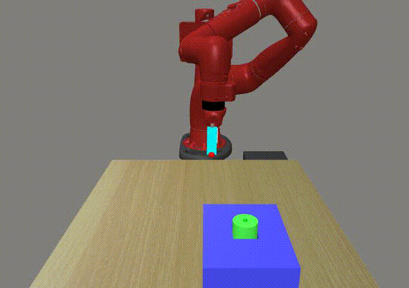
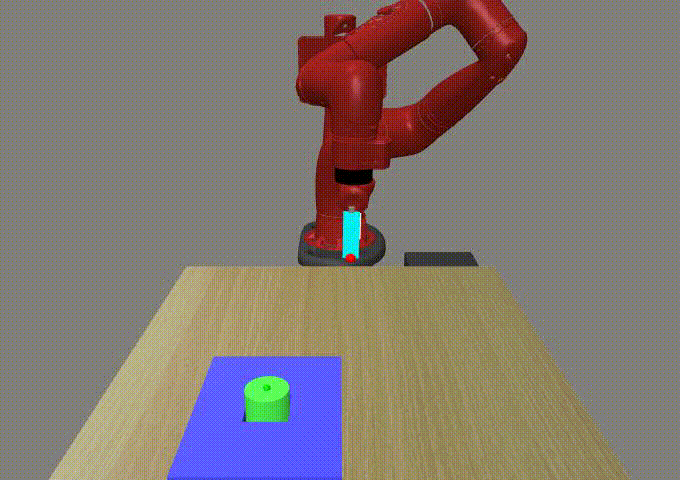
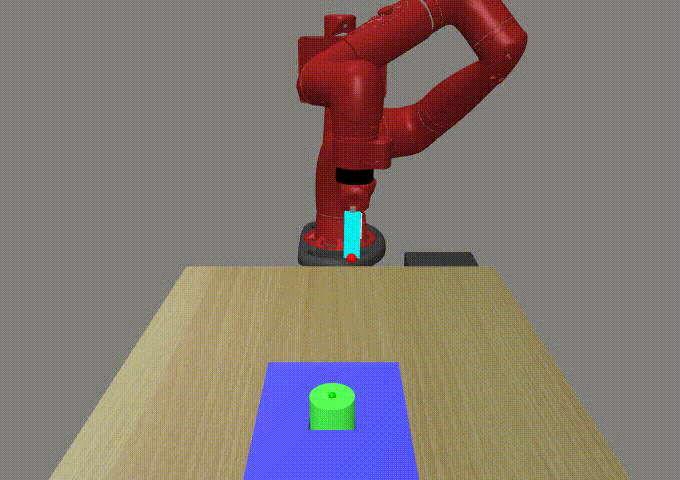

# SRMRL: Informative Skill Embeddings for Meta Reinforcement Learning

This is the implementation of SRMRL and this repository is based on [garage](https://github.com/rlworkgroup/garage).

## Installation
To install locally, you will need to first install [MuJoCo](https://www.roboti.us/index.html). Set `LD_LIBRARY_PATH` to point to both the MuJoCo binaries (`/$HOME/.mujoco/mujoco200/bin`) as well as the gpu drivers (something like `/usr/lib/nvidia-390`, you can find your version by running `nvidia-smi`).

Clone this repo and construct a virtual environment via `pipenv install -r requirements.txt`. Then activate the virtual environment with `pipenv shell`.
The implementation of SRMRL is placed in `garage/torch/algos/srmrl.py`. Add the `garage` package into your python path with `export PYTHONPATH=.:$PYTHONPATH` in SRMRL directory.

## Experiments
To run the experiments,
```
python example/[filename].py --env_name=[env_name]
```
The output files including log file and model parameters will be placed in `./data/local/experiment/[EXP_NAME]`.
The output log file can be visualized with tensorboard. 
The file `progress.csv` contains statistics logged over the course of training.
We recommend `viskit` for visualizing learning curves: https://github.com/vitchyr/viskit.

After training, use `sim_policy.py` to visualize the learned policy:
```
python sim_policy.py --model_dir=[output_dir]
```
This script generate images and gif file of trajectories.

## Visulization of learned polices
  
  

  

   

   

   

